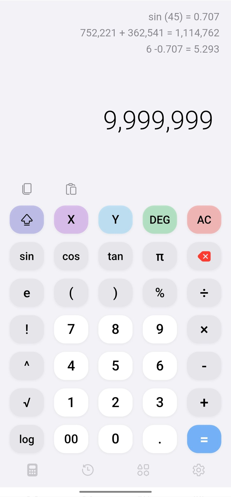
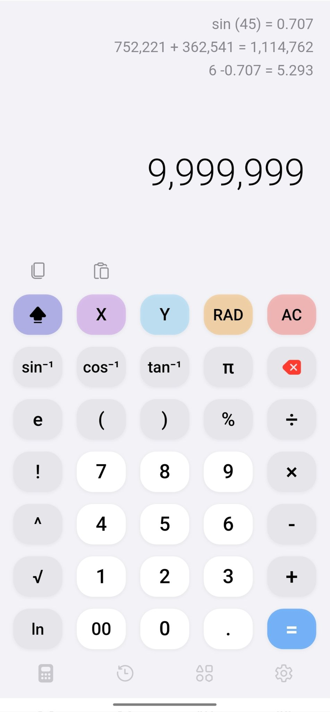
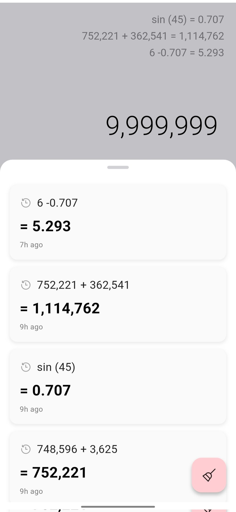
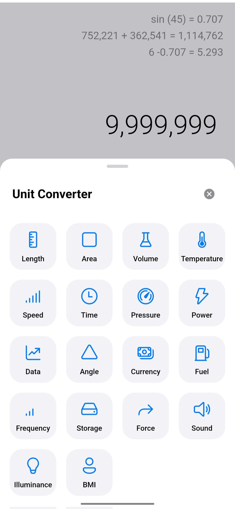
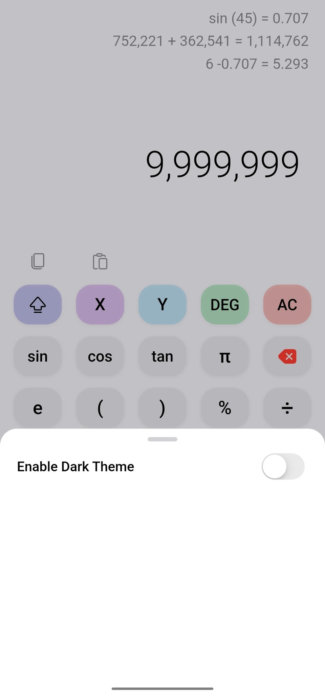

# Pro Calc

The Flutter Calculator app integrated with Riverpod. The calculator has sci. calculator by default and unit converter. I am also adding more tools.

Package used:

+ exath_engine for math evaluations
+ Quantify package for unit converter

# Screenshots

